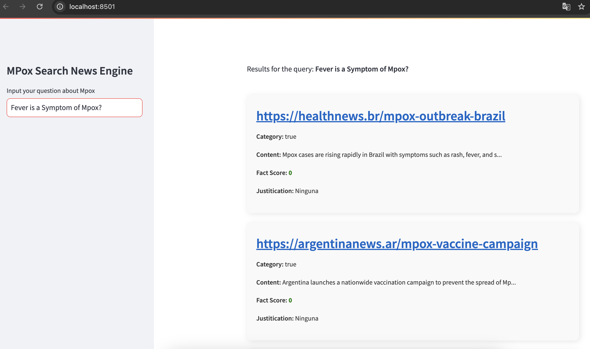
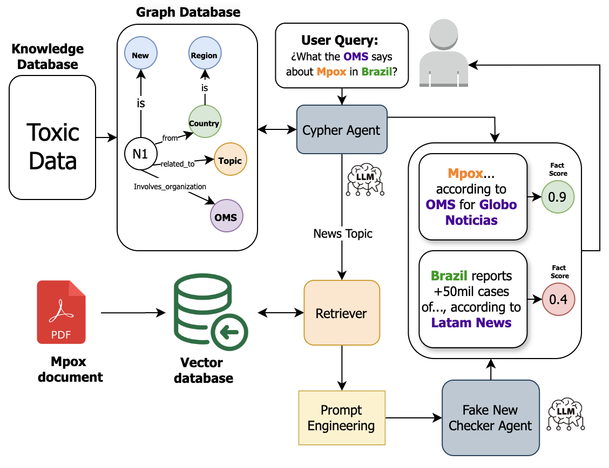
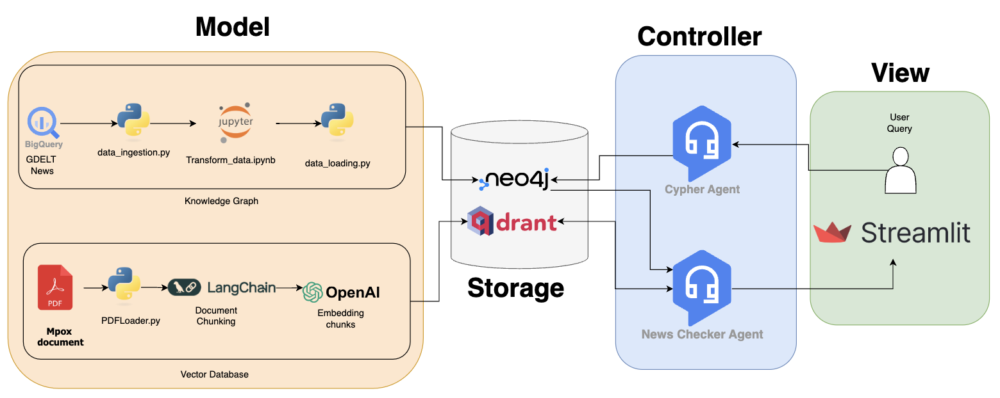

# FakeMPOX

## Getting Started

This repository hosts the FakeMPOX project, a self-checker news analysis tool that runs using Streamlit. To start using or contributing to the project, follow the installation and usage instructions below.





## Installation

To install the necessary requirements and run the project, follow these steps:

### Requirements
- **Python Version**: 3.8 or higher
- **Pip**: Make sure you have `pip` installed for managing Python packages.
- **Streamlit**: This project uses Streamlit to serve the app.

### Steps
1. Clone the repository:

    ```bash
    git clone https://gitlab.ic.unicamp.br/mo656/24s2/fakempox.git
    cd fakempox
    ```

2. Create and activate a virtual environment (optional but recommended):

    ```bash
    python3 -m venv venv
    source venv/bin/activate  # For Windows, use: venv\Scripts\activate
    ```

3. Install the dependencies:

    ```bash
    pip install -r requirements.txt
    ```

4. Run the application using Streamlit:

    ```bash
    streamlit run app.py
    ```

## Project Architecture

The project follows a modular architecture. Below is a visual representation of the project’s architecture:



## Pipeline

The data processing and model pipeline is as follows:




## Contributing

Contributions are welcome! Please follow these steps to contribute:

1. Fork the repository.
2. Create a new branch for your feature or bugfix.
3. Submit a pull request once your changes are ready.

## Authors and Acknowledgments

- **Luis Fernando Solis Navarro**, Computer Science student at UNICAMP, Brazil.
- Contributors: **Team Members**

## License

This project is licensed under the MIT License - see the [LICENSE](LICENSE) file for details.

## Project Status

The project is actively maintained. Feel free to contribute or report issues.

## How to Cite

If you use this project in your research or work, please cite it as follows:

 ```bash
@misc{fakempox2024,
  author = {Luis Fernando Solis Navarro},
  title = {FakeMPOX: A Self-Checker News Analyzer},
  year = {2024},
  howpublished = {\url{https://gitlab.ic.unicamp.br/mo656/24s2/fakempox}},
}
```
